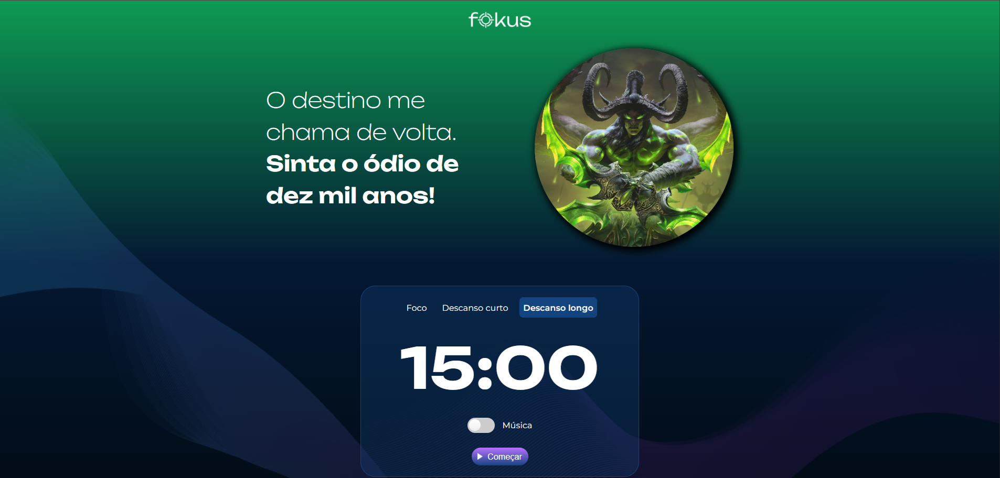

# Fokus - Temporizador Pomodoro com Tema de World of Warcraft

Este é um projeto de um temporizador no estilo Pomodoro, desenvolvido originalmente como parte de um curso de JavaScript da Alura. A aplicação foi personalizada com uma temática inspirada no universo de **World of Warcraft**, utilizando imagens e sons do jogo para criar uma experiência mais imersiva e divertida.

## 🚀 Sobre o Projeto

O Fokus é uma ferramenta de produtividade que ajuda o usuário a manter o foco em tarefas através de ciclos de trabalho e descanso. A interface muda de cor, imagem e texto de acordo com o modo selecionado: Foco, Descanso Curto ou Descanso Longo.

## ✨ Características

- **Três Modos de Operação:**
  - **Foco:** Período de trabalho concentrado (25 minutos).
  - **Descanso Curto:** Pausa breve para relaxar (5 minutos).
  - **Descanso Longo:** Pausa estendida após vários ciclos de foco (15 minutos).
- **Interface Dinâmica:** O fundo, a imagem principal e os títulos se alteram para refletir o contexto atual.
- **Controle de Áudio:** Efeitos sonoros temáticos para iniciar, pausar e finalizar o temporizador.
- **Música de Fundo:** Opção de ligar ou desligar uma música ambiente para maior imersão.
- **Responsividade:** O layout se adapta a diferentes tamanhos de tela, como tablets e celulares.

## 🛠️ Tecnologias Utilizadas

O projeto foi construído com as seguintes tecnologias web:

- **HTML5:** Estruturação semântica da página.
- **CSS3:** Estilização, layouts com Flexbox, variáveis CSS para temas e design responsivo.
- **JavaScript (ES6+):** Manipulação do DOM, controle de eventos, lógica do temporizador (`setInterval`, `clearInterval`) e reprodução de áudio.

## 📂 Como Executar

1.  Clone este repositório: `git clone https://github.com/seu-usuario/seu-repositorio.git`
2.  Navegue até o diretório do projeto.
3.  Abra o arquivo `index.html` em seu navegador de preferência.

O projeto também está disponível online através do GitHub Pages.

## 📜 Créditos

- **Projeto Base:** Desenvolvido durante o curso "JavaScript: manipulando o DOM" da Alura.
- **Personalização:** Tema, imagens e sons de World of Warcraft adicionados para fins de estudo e diversão. As imagens e sons são propriedade da Blizzard Entertainment.